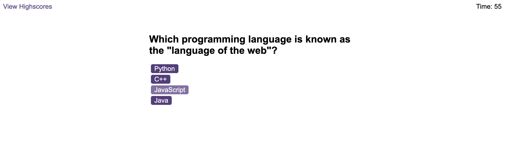

# Code Quiz
Module 6 Challenge for EDX Bootcamp in Front End Web Development

<!-- TABLE OF CONTENTS -->

  
Table of Contents

  <ol>
    <li>
      <a href="#description">Description</a>
      <ul>
        <li><a href="#built-with">Built With</a></li>
      </ul>
    </li>
    <li>
        <a href="#installation">Installation</a>
    </li>
    <li><a href="#usage">Usage</a></li>
    <li><a href="#license">License</a></li>
    <li><a href="#contact">Contact</a></li>
    <li><a href="#acknowledgments">Acknowledgments</a></li>
  </ol>

<!-- ABOUT THE PROJECT -->
## Description

 
 
This was the 6th homework challenge for the EDX Bootcamp in Front End Development.
 

   
Our task was to build a timed coding quiz with multiple-choice questions. This app runs in the browser, and features dynamically updated HTML and CSS powered by JavaScript code. 

 

 
The quiz has 5 multiple choice questions based on coding to answer, and a leaderboard that displays the initials and score of the user in ascending order.

 

### Built With

* 
* 
* 

## Installation

N/A

<!-- USAGE EXAMPLES -->
## Usage

To use this project, please open the website in Chrome and then click the 'Start Quiz' button.

The timer will start at 75 seconds and you will be given the first multiple choice question.

If answered correctly you will move onto the next question. If answered incorrectly you will have 10 seconds deducted from the timer and will then move onto the next question.

Correct and incorrect answers will also play a sound when clicked.

Once all 5 questions have been answered you will be asked to enter your initials. There will be alerts if no text is entered or if the text is more than 3 characters.

The score and initials will be stored in the browser local storage, and then you will then be taken to the high score leaderboard where you will see your score. You can play again to try to improve your score, and the leaderboard will display the scores in ascending order.

<!-- LICENSE -->
## License

Distributed under the MIT License. See `LICENSE.txt` for more information.

<!-- CONTACT -->
## Contact

Richard Llewellyn - richard.lee.llewellyn@gmail.com 

Project Link: [https://richllew182.github.io/code-quiz/](https://richllew182.github.io/code-quiz/)

Project Repo Link: [https://github.com/RichLlew182/code-quiz](https://github.com/RichLlew182/code-quiz)

<!-- ACKNOWLEDGMENTS -->
## Acknowledgments

* [Img Shields](https://shields.io)
* [Best README Template](https://github.com/othneildrew/Best-README-Template)
